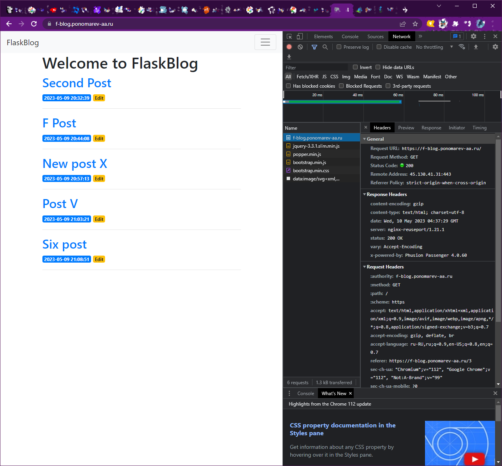
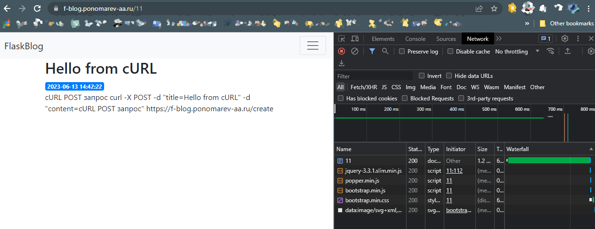

# F BLOG

FlaskBlog :: View, Create, Edit, Delete.

```
(.venv) PS C:\Users\ponom\Documents\CODE\F_BLOG\flask_blog_app> flask run
```

1


2


3


# Hosting

It's works from Beget https://beget.com/

https://f-blog.ponomarev-aa.ru/

(2023-05-10)



# cURL :: POST

```
curl -X POST -d "title=Hello from cURL" -d "content=cURL POST запрос" https://f-blog.ponomarev-aa.ru/create
```




# NEXT

```bash
export PYTHONPATH=/home/alponomarev/myscr/F_BLOG/flask_blog_app
flask --app flask_blog_app/ run
```
